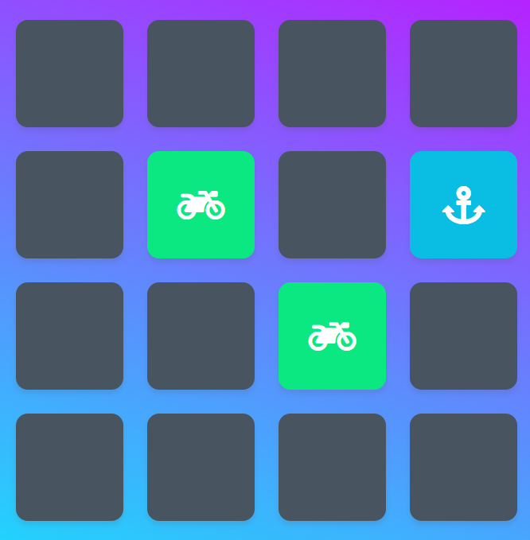

# Udacity Front-End Nanodegree Project 2: Memory Game

## Description
This matching game tests a user's memory as they try to match each set of cards in the deck.

## Challenge
There's more to the game than just matching the cards! When playing, a user is timed and receives a star rating based on the number of moves they took to match all the cards.

## How to Play
* Visit https://markoblack.com/udacity-fend-memory-game/
* Click on a card
* Click on another card
* If the cards match, they will change to green and stay flipped up
* If the cards do not match, they will briefly turn red and then flip over
* Repeat until all cards are matched!

## How I Built the Memory Game
I took some inspiration from the following repository on GitHub: https://github.com/sandraisrael/Memory-Game-fend
* This web app uses pure Vanilla JS for functionality
* Card flips are completed by removing/adding CSS classes to each card
* Moves are stored in a count variable; star rating is computer based on the value of the count variable
* A timer function starts as soon as the page is loaded (time does not affect star rating)
* A congratulations popup function is run once all cards are matched. This popup displays the total number of moves, time, and star rating. A user can then restart the game to play again.
